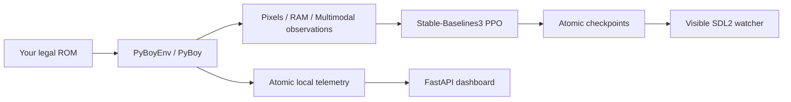

# aiPlays

aiPlays is a Windows-first, local reinforcement-learning platform for training PPO agents to play legally supplied Game Boy or Game Boy Color ROMs through [PyBoy](https://docs.pyboy.dk/). It starts with a conservative Pokemon Red adapter but keeps the emulator, observations, rewards, and training plumbing extensible for other games.

No ROM, save file, or other copyrighted game data is included, downloaded, or committed.



## Requirements and setup

Use 64-bit Python 3.10 or 3.11 on Windows; the setup script selects Python 3.11. It creates `.venv`, installs the package and development tools, records `requirements-lock.txt`, runs the doctor, then runs tests.

```powershell
cd D:\aiPlayer
powershell -ExecutionPolicy Bypass -File .\scripts\setup.ps1
```

Add a ROM you legally obtained yourself. Setup never downloads one.

```powershell
Copy-Item "C:\path\to\your\legal\pokemon_red.gb" ".\roms\pokemon_red.gb"
.\scripts\doctor.ps1 -RequireRom
.\scripts\manual-play.ps1
```

If your name/path differs, change `game.rom_path` in `configs\pokemon_red.yaml` or set `AIPLAYS_ROM_PATH`. ROMs (`*.gb`, `*.gbc`) and states (`*.state`, `*.sav`) are deliberately Git-ignored.

## Everyday workflow

Manual play opens PyBoy’s visible SDL2 window and lets its normal keyboard handling run directly. It does not invoke the RL action loop, frame skip, or episode limit. Manual mode defaults to 1x speed even when headless training uses `speed: 0`; press Tab to toggle unlimited-speed turbo, or pass `--speed 0` when you explicitly want it all the time.

In-game Pokemon saves are battery-backed and persist in `roms\pokemon_red.gb.ram` when PyBoy exits cleanly. This is distinct from PyBoy's `Z`/`X` emulator snapshot shortcuts, which use `pokemon_red.gb.state`. Loading an old `.state` can overwrite newer in-game progress, so avoid `X` unless you intentionally want that snapshot.

```powershell
.\scripts\manual-play.ps1
.\scripts\train-visible.ps1 -Timesteps 50000
```

Visible training is intentionally single-environment and slower. For faster headless runs, keep training headless and use a separate watcher:

```powershell
.\scripts\train.ps1 -Timesteps 1000000 -NumEnvs 1
.\scripts\dashboard.ps1             # http://127.0.0.1:8765
.\scripts\watch.ps1                 # loads models\latest.zip
```

The equivalent direct commands are:

```powershell
python -m aiplays doctor
python -m aiplays train --config configs\pokemon_red.yaml --timesteps 1000000 --num-envs 1 --device auto
python -m aiplays train --config configs\pokemon_red.yaml --timesteps 50000 --num-envs 1 --render
python -m aiplays watch --config configs\pokemon_red.yaml --model models\latest.zip
python -m aiplays dashboard
python -m aiplays verify-ram --config configs\pokemon_red.yaml
```

Resume with `python -m aiplays train --config configs\pokemon_red.yaml --resume models\latest.zip`. Interrupted runs save a final model; checkpoints are written per run and atomically copied to `models\latest.zip`. TensorBoard event files go under `logs`; run `.\.venv\Scripts\tensorboard.exe --logdir .\logs`.

## Configuration and rewards

`configs\pokemon_red.yaml` controls the game, emulator action timing/window, observation mode, PPO settings, paths, and dashboard. Environment overrides are `AIPLAYS_ROM_PATH`, `AIPLAYS_STATE_PATH`, `AIPLAYS_DEVICE`, `AIPLAYS_MODELS_DIR`, `AIPLAYS_LOGS_DIR`, `AIPLAYS_RUNS_DIR`, `AIPLAYS_DASHBOARD_HOST`, and `AIPLAYS_DASHBOARD_PORT`.

Observations are `pixels` (copied RGBA framebuffer, alpha removed, resized/stacked `uint8` channels-first), `ram` (bounded normalized values), or `multimodal` (a Gymnasium dictionary for `MultiInputPolicy`). Buttons are pressed, ticked for the configured action window, released, and ticked again; cleanup releases every enabled button.

`configs\reward_profiles\exploration.yaml` contains ROM-independent novelty/step shaping. The Pokemon profile has coordinate/map/badge/party deltas. Coordinates are keyed by `(map_id, x, y)`, all progression rewards are deltas, and uncertain Pokedex/event/battle signals are disabled. Reward shaping is experimental; this repository does not claim a fixed training time or guaranteed Pokemon completion.

The initial reader documents addresses against the `pret/pokered` disassembly symbols and bounds decoded values. Use `verify-ram` while manually moving before trusting a reward on your ROM revision.

## Architecture and extension

`PyBoyEnv` is generic. `PokemonRedEnv` and `PokemonRedRamReader` are small adapter points, so another game can add an adapter/reader/reward profile without modifying PPO internals. The dashboard polls an atomic local JSON snapshot over a WebSocket; it is local-only and a dashboard failure cannot stop training.

## Troubleshooting and limitations

`aiplays doctor` distinguishes missing ROMs (expected) from package defects, and `--require-rom` makes it strict. If visible SDL2 fails while headless works, update graphics drivers and test `manual`; SDL availability is OS/display dependent. `--device auto` uses CUDA only when PyTorch detects a compatible NVIDIA GPU; choose `--device cpu` to force CPU. Windows multiprocessing uses `spawn` and safely falls back to a dummy vector environment when subprocess creation fails.

Only PyBoy-compatible GB/GBC games are in scope. Pokemon RAM locations vary by ROM revision and must be verified. There is no ROM fixture, so real-emulator validation requires your own legal file. The dashboard currently prioritizes training status/telemetry rather than storing a frame stream.

## Legal

You are responsible for supplying and using a ROM and any save state you are legally entitled to use. These files are excluded from version control. No project script downloads or generates them.
